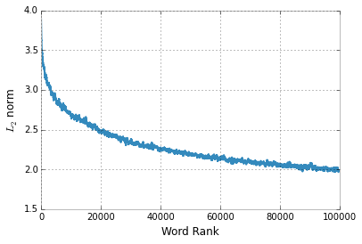

Word Embeddings
===============

Word embedding is a mapping of a word to a d-dimensional vector space.
This real valued vector representation captures semantic and syntactic
features. Polyglot offers a simple interface to load several formats of
word embeddings.

.. code:: python

    from polyglot.mapping import Embedding

Formats
-------

The Embedding class can read word embeddings from different sources:

-  Gensim word2vec objects: (``from_gensim`` method)
-  Word2vec binary/text models: (``from_word2vec`` method)
-  GloVe models (``from_glove`` method)
-  polyglot pickle files: (``load`` method)

.. code:: python

    embeddings = Embedding.load("/home/rmyeid/polyglot_data/embeddings2/en/embeddings_pkl.tar.bz2")

Nearest Neighbors
-----------------

A common way to investigate the space capture by the embeddings is to
query for the nearest neightbors of any word.

.. code:: python

    neighbors = embeddings.nearest_neighbors("green")
    neighbors

.. parsed-literal::

    [u'blue',
     u'white',
     u'red',
     u'yellow',
     u'black',
     u'grey',
     u'purple',
     u'pink',
     u'light',
     u'gray']

to calculate the distance between a word and the nieghbors, we can call
the ``distances`` method

.. code:: python

    embeddings.distances("green", neighbors)

.. parsed-literal::

    array([ 1.34894466,  1.37864077,  1.39504588,  1.39524949,  1.43183875,
            1.68007386,  1.75897062,  1.88401115,  1.89186132,  1.902614  ], dtype=float32)

The word embeddings are not unit vectors, actually the more frequent the
word is the larger the norm of its own vector.

.. code:: python

    %matplotlib inline
    import matplotlib.pyplot as plt
    import numpy as np

.. code:: python

    norms = np.linalg.norm(embeddings.vectors, axis=1)
    window = 300
    smooth_line = np.convolve(norms, np.ones(window)/float(window), mode='valid')
    plt.plot(smooth_line)
    plt.xlabel("Word Rank"); _ = plt.ylabel("$L_2$ norm")

This could be problematic for some applications and training algorithms.
We can normalize them by :math:`L_2` norms to get unit vectors to reduce
effects of word frequency, as the following

.. code:: python

    embeddings = embeddings.normalize_words()

.. code:: python

    neighbors = embeddings.nearest_neighbors("green")
    for w,d in zip(neighbors, embeddings.distances("green", neighbors)):
      print("{:<8}{:.4f}".format(w,d))

.. parsed-literal::

    white   0.4261
    blue    0.4451
    black   0.4591
    red     0.4786
    yellow  0.4947
    grey    0.6072
    purple  0.6392
    light   0.6483
    pink    0.6574
    colour  0.6824

Vocabulary Expansion
--------------------

.. code:: python

    from polyglot.mapping import CaseExpander, DigitExpander

Not all the words are available in the dictionary defined by the word
embeddings. Sometimes it would be useful to map new words to similar
ones that we have embeddings for.

Case Expansion
~~~~~~~~~~~~~~

For example, the word ``GREEN`` is not available in the embeddings,

.. code:: python

    "GREEN" in embeddings

.. parsed-literal::

    False

we would like to return the vector that represents the word ``Green``,
to do that we apply a case expansion:

.. code:: python

    embeddings.apply_expansion(CaseExpander)

.. code:: python

    "GREEN" in embeddings

.. parsed-literal::

    True

.. code:: python

    embeddings.nearest_neighbors("GREEN")

.. parsed-literal::

    [u'White',
     u'Black',
     u'Brown',
     u'Blue',
     u'Diamond',
     u'Wood',
     u'Young',
     u'Hudson',
     u'Cook',
     u'Gold']

Digit Expansion
~~~~~~~~~~~~~~~

We reduce the size of the vocabulary while training the embeddings by
grouping special classes of words. Once common case of such grouping is
digits. Every digit in the training corpus get replaced by the symbol
``#``. For example, a number like ``123.54`` becomes ``###.##``.
Therefore, querying the embedding for a new number like ``434`` will
result in a failure

.. code:: python

    "434" in embeddings

.. parsed-literal::

    False

To fix that, we apply another type of vocabulary expansion
``DigitExpander``. It will map any number to a sequence of ``#``\ s.

.. code:: python

    embeddings.apply_expansion(DigitExpander)

.. code:: python

    "434" in embeddings

.. parsed-literal::

    True

As expected, the neighbors of the new number ``434`` will be other
numbers:

.. code:: python

    embeddings.nearest_neighbors("434")

.. parsed-literal::

    [u'##',
     u'#',
     u'3',
     u'#####',
     u'#,###',
     u'##,###',
     u'##EN##',
     u'####',
     u'###EN###',
     u'n']

Demo
----

Demo is available `here <https://bit.ly/embeddings>`__.

Citation
~~~~~~~~

This work is a direct implementation of the research being described in
the `Polyglot: Distributed Word Representations for Multilingual
NLP <http://www.aclweb.org/anthology/W13-3520>`__ paper. The author of
this library strongly encourage you to cite the following paper if you
are using this software.

::

    @InProceedings{polyglot:2013:ACL-CoNLL,
     author    = {Al-Rfou, Rami  and  Perozzi, Bryan  and  Skiena, Steven},
     title     = {Polyglot: Distributed Word Representations for Multilingual NLP},
     booktitle = {Proceedings of the Seventeenth Conference on Computational Natural Language Learning},
     month     = {August},
     year      = {2013},
     address   = {Sofia, Bulgaria},
     publisher = {Association for Computational Linguistics},
     pages     = {183--192}, 
     url       = {http://www.aclweb.org/anthology/W13-3520}
    }
